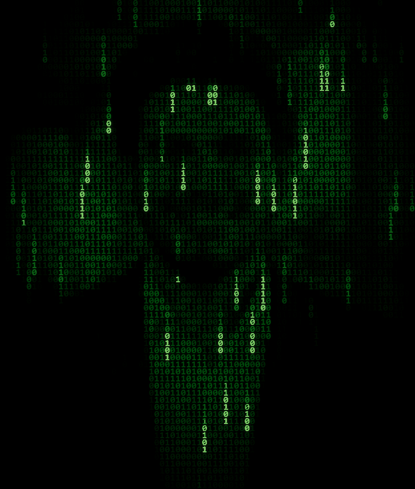

 

 

## 🧑‍💻 About Me

- 🎓 **BS in Software Engineering** graduate, **SMI University**, Karachi, Pakistan
- 💻 I like building things across the stack — scripts, apps, whatever the problem needs
- 🌱 Always learning, always shipping
- 📫 Reach me at **aijazsameer5@gmail.com**
- 🐍 Fun fact: my contribution graph has a mind of its own — scroll down and watch it get eaten

## 🛠️ Tech Stack

## 📊 GitHub Stats

  
  

  

  

## 📈 Activity

## 🧊 Contributions in 3D

## 🐍 Contribution Snake

## 🌐 Connect With Me

